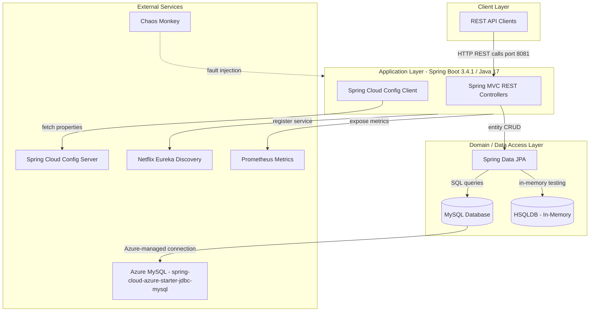
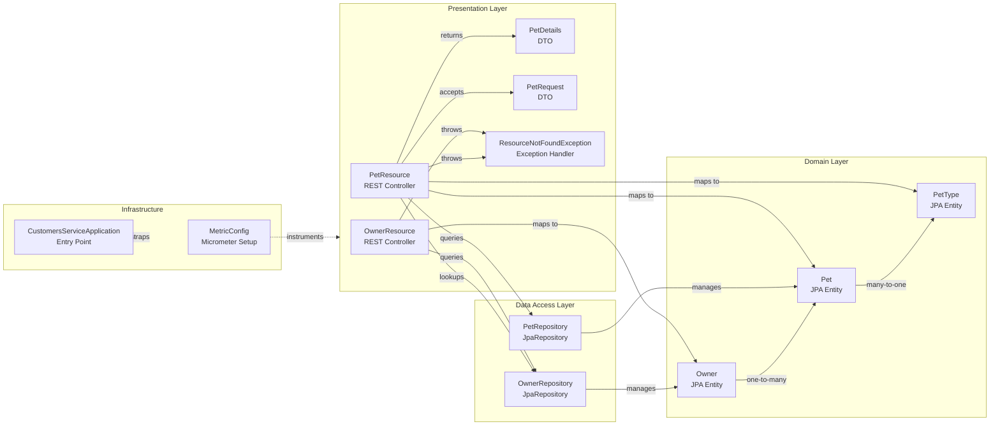

# Architecture Diagram

This Spring Boot microservice implements a RESTful customers service with JPA-based data access, Spring Cloud Config integration, and Eureka service discovery.

## Application Architecture

## Component Relationships

