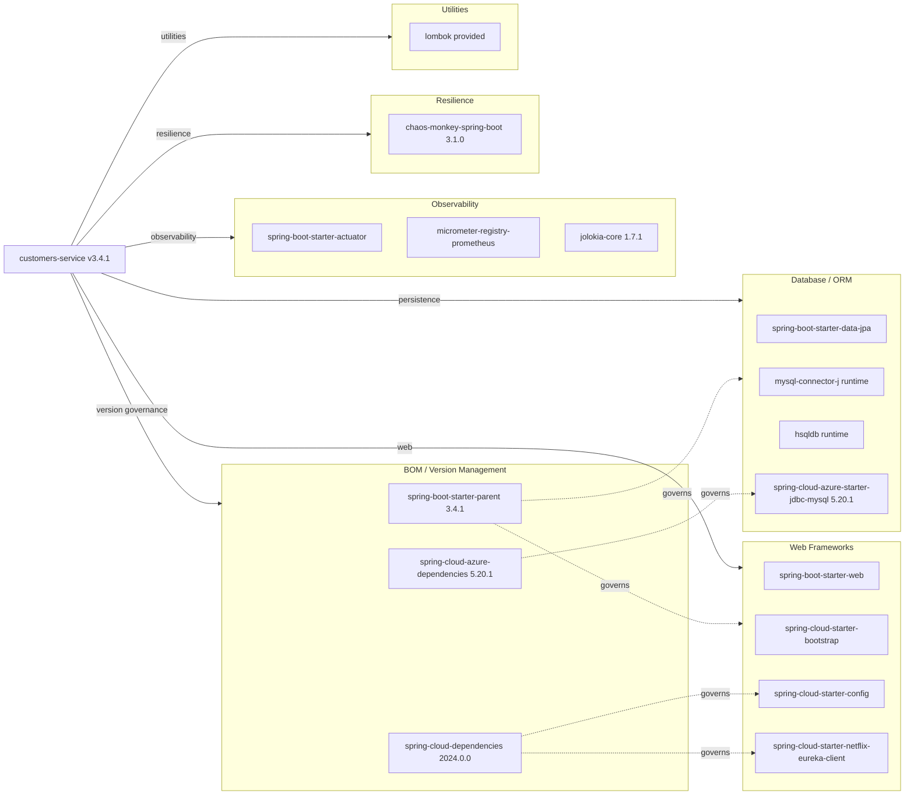

# Dependency Map

The Spring PetClinic Customers Service declares 18 runtime/compile dependencies managed via Maven, with version governance through Spring Boot 3.4.1 BOM and Spring Cloud 2024.0.0 BOM.

## Dependencies

